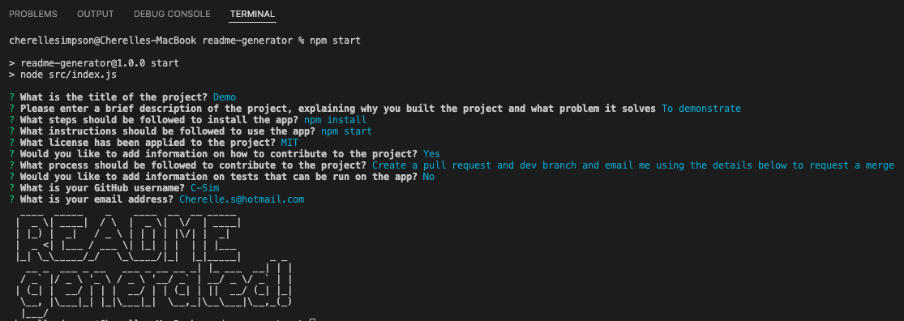
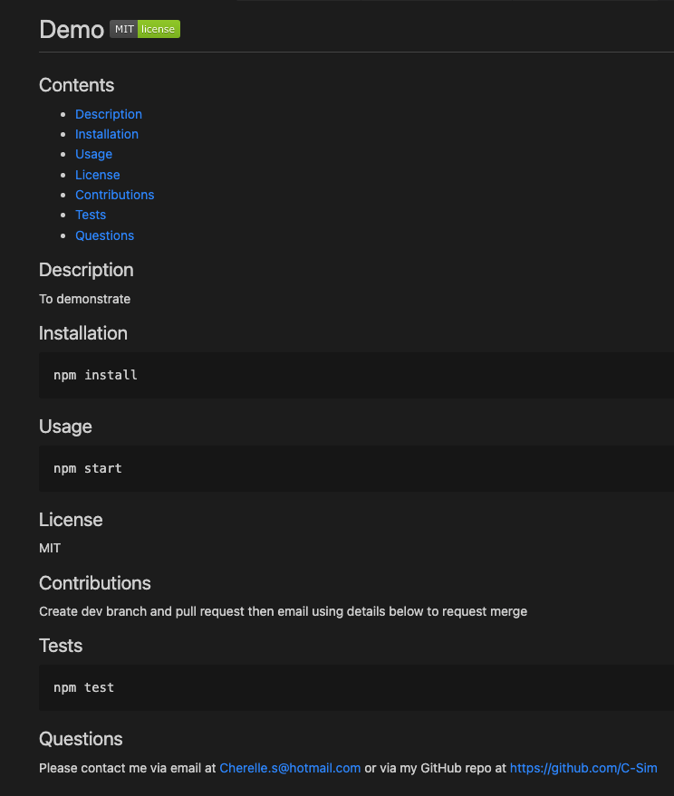

# readme-generator 

[Demo](https://drive.google.com/file/d/1wCfdWHnkdtJ8Yb8K1r3Zj_ot0dvN9S-P/view)

## Contents

- [Description](#description)
- [Installation](#installation)
- [Usage](#usage)
- [License](#license)
- [Contributions](#contributions)

- [Questions](#questions)

## Description

A node.js application that dynamically generates a professional README.md file from a user's input. It prompts the user to enter a range of details which comprise a strong README so that one can be created in a clear layout and format. Conditional questions allow the user to leave out contributions and testing information if these aren't relevant to their project.

## Installation

```
npm install
```

## Usage

```
npm start
```

## License

MIT

## Contributions

Create a dev branch and pull request on GitHub - contact me using the details below to request a merge to the main branch

## Questions

Please contact me via email at Cherelle.S@hotmail.com or via my GitHub repo at https://github.com/C-Sim

## Technologies

- Inquirer
- Node
- fs
- Figlet

## Screenshots

<details>
<summary>Terminal User Journey</summary>



</details>

<details>
<summary>Generated README</summary>



</details>
<br>

## User Story

```md
AS A developer
I WANT a README generator
SO THAT I can quickly create a professional README for a new project
```

## Acceptance Criteria

```md
GIVEN a command-line application that accepts user input
WHEN I am prompted for information about my application repository
THEN a high-quality, professional README.md is generated with the title of my project and sections entitled Description, Table of Contents, Installation, Usage, License, Contributing, Tests, and Questions
WHEN I enter my project title
THEN this is displayed as the title of the README
WHEN I enter a description, installation instructions, usage information, contribution guidelines, and test instructions
THEN this information is added to the sections of the README entitled Description, Installation, Usage, Contributing, and Tests
WHEN I choose a license for my application from a list of options
THEN a badge for that license is added near the top of the README and a notice is added to the section of the README entitled License that explains which license the application is covered under
WHEN I enter my GitHub username
THEN this is added to the section of the README entitled Questions, with a link to my GitHub profile
WHEN I enter my email address
THEN this is added to the section of the README entitled Questions, with instructions on how to reach me with additional questions
WHEN I click on the links in the Table of Contents
THEN I am taken to the corresponding section of the README
```
